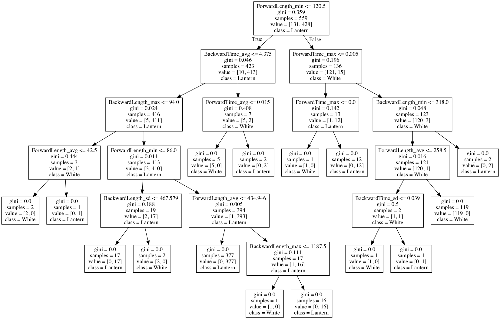

## Branch bohao
Name:吴柏豪

### Finished:
- Get features dictionary for traffic data:
    - packet length
    - time delta
    - time relative
    - forward or backward
    - mark information
- Get flow dictionary for traffic data using mark information:
    - packet length
    - time delta
    - time relative
- Save the dictionary with pickle
- Implement Decision Tree with sklearn
    - Initial Result:
    
### Working:
- Data set collection
    - VPN Traffic
    - White Traafic
- Machine learning algorithm
    - C4.5
    - CART
    - Random forest
